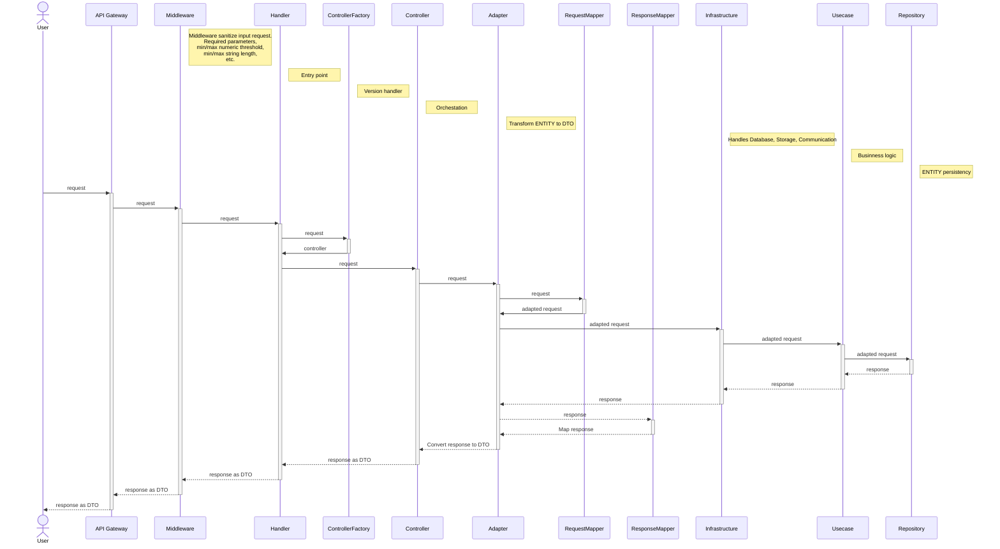

# Middleware RESTFul API

## Architecture

Common request/response path.

### Handler

### Controller (Coordinator)

In Clean Architecture, a Controller serves as an intermediary between external requests and the system, orchestrating the interaction between the presentation layer and the inner layers, but without directly handling business logic. Its primary role is to receive requests, invoke the appropriate use cases, and return responses to the users.

### Adapter (Transform ENTITY to DTO)

### Infraestructure (Enable Database, Socket, http, or any other infrastructure required)

### Usecase (Orchestation, Consistency and Businness logic)

### Repository (Persistence layer supported by the infrastructure layer. )
